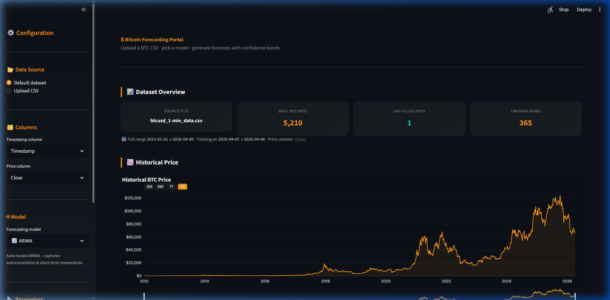
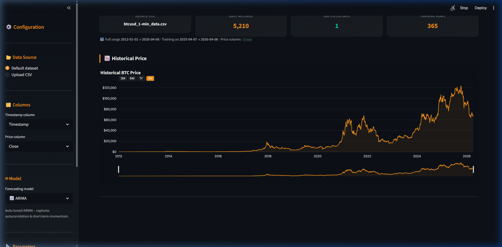
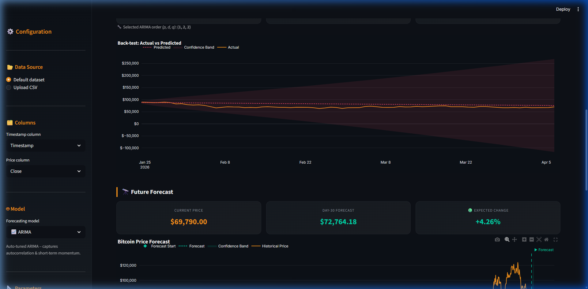
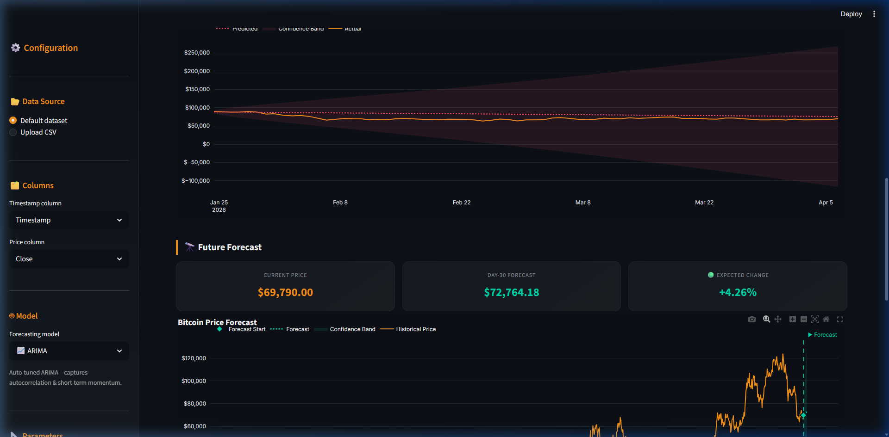
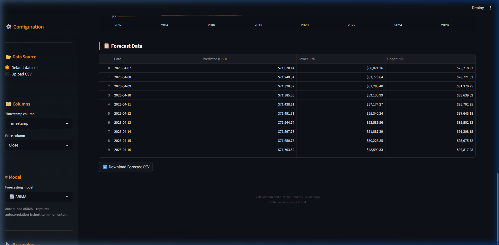

<div align="center">

# ₿ Bitcoin Price Forecasting Portal

**An interactive, production-ready time-series forecasting dashboard for Bitcoin price prediction — powered by four industry-standard models and built with Streamlit.**

[](https://streamlit.io)
[](https://python.org)
[](https://plotly.com)
[](https://tensorflow.org)
[](LICENSE)

<br>



</div>

---

## 📋 Table of Contents

- [Overview](#-overview)
- [Key Features](#-key-features)
- [Screenshots](#-screenshots)
- [Project Structure](#-project-structure)
- [Installation](#-installation)
- [Usage](#-usage)
- [Deployment on Streamlit Cloud](#-deployment-on-streamlit-cloud)
- [How the Forecasting Works](#-how-the-forecasting-works)
- [Technologies Used](#-technologies-used)
- [Future Improvements](#-future-improvements)
- [License & Disclaimer](#-license--disclaimer)

---

## 🔍 Overview

The **Bitcoin Forecasting Portal** is a full-featured web application that lets users upload Bitcoin historical price data (or use the bundled default dataset), configure a forecasting model, and generate future price projections with statistical confidence intervals — all from an intuitive, dark-themed dashboard.

The application is designed with a clean separation between the **UI presentation layer** (`app.py`) and the **forecasting engine** (`forecasting.py`), making the codebase maintainable, testable, and easy to extend with new models.

### Why This Project?

- **Multi-model comparison** — Switch between ARIMA, Prophet, LSTM, and Holt-Winters with a single click to compare how different approaches handle crypto volatility.
- **Built-in backtesting** — Every forecast includes a hold-out evaluation with MAE, RMSE, and MAPE so you can assess model accuracy before trusting the projection.
- **Production-quality UI** — BTC-branded dark theme, glassmorphic metric cards, interactive Plotly charts with range selectors, and a responsive layout that works on any screen size.

---

## ✨ Key Features

### 📊 Data Handling
- **Flexible CSV upload** — Drag-and-drop any Bitcoin CSV or use the bundled Kaggle dataset
- **Smart column detection** — Automatically identifies timestamp and price columns (supports `Timestamp`, `Date`, `Unix`, `Close`, `Open`, `High`, `Low`, and more)
- **Robust timestamp parsing** — Handles Unix timestamps (seconds, milliseconds, microseconds), ISO 8601, and common date formats
- **Data quality validation** — Detects and reports unsorted rows, duplicate timestamps, and missing days with automatic gap-filling

### 🤖 Forecasting Models
| Model | Type | Strengths |
|-------|------|-----------|
| **ARIMA** | Statistical | Auto-tuned via `pmdarima`; captures autocorrelation and short-term momentum patterns |
| **Prophet** | Additive | Facebook's time-series library; robust to missing data with trend and seasonality decomposition |
| **LSTM** | Deep Learning | Recurrent neural network with memory cells; learns complex non-linear temporal patterns |
| **Holt-Winters** | Exponential Smoothing | Additive trend + weekly seasonal components; lightweight and fast to train |

### 📐 Configurable Parameters
- **Forecast horizon** — 7 to 365 days ahead
- **Confidence interval** — 80% to 99% uncertainty bands
- **Training window** — Last 180 / 365 / 730 days, full history, or custom range
- **Column selection** — Choose which timestamp and price columns to model

### 📈 Evaluation & Visualization
- **Hold-out backtesting** with MAE, RMSE, and MAPE metrics (in USD)
- **Back-test chart** — Actual vs. predicted overlay on the hold-out period
- **Forecast chart** — Historical prices + projected trend with confidence bands
- **Interactive Plotly charts** — Range selectors (3M / 6M / 1Y / All), zoom, pan, and hover tooltips
- **Forecast data table** — Dollar-formatted with CSV export

### 🎨 UI / UX
- **BTC-branded dark theme** — Orange primary (`#F7931A`), dark gradient backgrounds, Inter typeface
- **Glassmorphic metric cards** with hover animations
- **Organized sidebar** — Data source, column mapping, model selection, parameters, and training window
- **Forecast summary cards** — Current price, end-of-horizon forecast, and expected % change

---

## 📸 Screenshots

<div align="center">

| Dashboard & Sidebar | Historical Chart |
|:---:|:---:|
|  |  |

| Backtest Results | Forecast Output |
|:---:|:---:|
|  |  |

| Forecast Summary Cards | Data Table & Export |
|:---:|:---:|
|  |  |

</div>

---

## 📁 Project Structure

```
btc-forecasting-portal/
│
├── app.py                    # Streamlit UI layer — layout, charts, controls
├── forecasting.py            # Forecasting engine — data prep, models, metrics
├── requirements.txt          # Python dependencies
├── runtime.txt               # Python version for Streamlit Cloud (3.11)
│
├── .streamlit/
│   └── config.toml           # Streamlit theme & server configuration
│
├── datasets/
│   └── btcusd_1-min_data.csv # Default BTC dataset (gitignored)
│
├── assets/                   # Screenshots for README
│   ├── dashboard.png
│   ├── historical_chart.png
│   ├── backtest_results.png
│   ├── forecast_output.png
│   ├── summary_cards.png
│   └── data_table.png
│
├── .gitignore
└── README.md
```

> **Note:** The `datasets/` directory is gitignored due to the large file size (~394 MB for minute-level data). See [Usage](#-usage) for how to obtain the dataset.

---

## 🛠 Installation

### Prerequisites

- **Python 3.11** (recommended; other 3.9+ versions may work)
- **pip** package manager
- ~2 GB disk space for dependencies (TensorFlow, Prophet, etc.)

### Step-by-step Setup

**1. Clone the repository**

```bash
git clone https://github.com/your-username/btc-forecasting-portal.git
cd btc-forecasting-portal
```

**2. Create and activate a virtual environment**

```bash
# Windows
python -m venv venv
venv\Scripts\activate

# macOS / Linux
python3 -m venv venv
source venv/bin/activate
```

**3. Install dependencies**

```bash
pip install --upgrade pip
pip install -r requirements.txt
```

**4. (Optional) Add the default dataset**

Download the [Bitcoin Historical Data](https://www.kaggle.com/datasets/mczielinski/bitcoin-historical-data) from Kaggle and place the CSV file at:

```
datasets/btcusd_1-min_data.csv
```

> You can also skip this step and upload any BTC CSV directly through the app's UI.

**5. Launch the application**

```bash
streamlit run app.py
```

The app will open automatically at `http://localhost:8501`.

---

## 🚀 Usage

### Quick Start

1. **Select a data source** — Use the default bundled dataset or upload your own CSV via the sidebar.
2. **Verify column mapping** — The app auto-detects timestamp and price columns. Adjust if needed.
3. **Choose a model** — Pick from ARIMA, Prophet, Holt-Winters, and LSTM when TensorFlow is available in the runtime.
4. **Configure parameters** — Set the forecast horizon (days), confidence interval (%), and training window.
5. **Generate forecast** — Click the primary button to train the model and view results.
6. **Analyze results** — Review backtest accuracy metrics, the actual-vs-predicted chart, forecast chart with uncertainty bands, and the data table.
7. **Export** — Download the forecast data as a CSV file.

### Compatible Datasets

The app works with any CSV that contains:
- A **date/timestamp column** — Unix timestamps (any precision), ISO dates, or common datetime formats
- A **numeric price column** — Named `Close`, `Open`, `High`, `Low`, `Price`, or `Last`

**Tested with:**
- [Kaggle — Bitcoin Historical Data (OHLCV, 1-min)](https://www.kaggle.com/datasets/mczielinski/bitcoin-historical-data)
- [Yahoo Finance BTC-USD exports](https://finance.yahoo.com/quote/BTC-USD/history/)
- [CoinGecko CSV exports](https://www.coingecko.com/)

---

## ☁️ Deployment on Streamlit Cloud

This project is pre-configured for one-click deployment on [Streamlit Community Cloud](https://streamlit.io/cloud).

### Steps

1. **Push to GitHub** — Ensure `app.py`, `forecasting.py`, `requirements.txt`, `runtime.txt`, and `.streamlit/config.toml` are committed.

2. **Connect on Streamlit Cloud** — Go to [share.streamlit.io](https://share.streamlit.io), sign in with GitHub, and select your repository.

3. **Configure deployment settings:**
   - **Main file path:** `app.py`
   - **Python version:** `3.11` (read from `runtime.txt`)

4. **Deploy** — Streamlit Cloud will install dependencies from `requirements.txt` and start the app.

### Important Notes

- The `datasets/` folder is gitignored. On Streamlit Cloud, users will need to upload a CSV through the UI (the "Upload CSV" data source option).
- `tensorflow-cpu` is specified in `requirements.txt` instead of the full `tensorflow` package to reduce memory usage on cloud environments.
- TensorFlow is installed only for Python versions below 3.13. On newer runtimes (for example 3.14), the app deploys without TensorFlow and automatically disables the LSTM model.
- The `.streamlit/config.toml` file sets `maxUploadSize = 512` MB to support large BTC datasets.

---

## 🧠 How the Forecasting Works

### Data Pipeline

```
Raw CSV → Column Detection → Timestamp Parsing → Chronological Sort
       → Duplicate Removal → Daily Resampling → Gap Filling (ffill)
       → Training Window Selection → Train/Test Split
```

1. **Column auto-detection** — Scans column names and data patterns to identify timestamp and price fields.
2. **Timestamp normalization** — Tries Unix epoch conversion (s/ms/µs/ns) with plausibility checks (year 2009–2100), then falls back to `pd.to_datetime`.
3. **Daily resampling** — Aggregates minute/hourly data to daily granularity with forward-fill for missing calendar days.
4. **Train/test split** — Reserves at least 20% of the data (or the forecast horizon, whichever is larger) as a hold-out test set.

### Model Details

#### 📈 ARIMA (Auto-Regressive Integrated Moving Average)
- **Order selection:** `pmdarima.auto_arima` with stepwise search, AIC criterion, `max_p=3`, `max_q=3`, `max_d=2`
- **Confidence intervals:** Derived from the ARIMA model's forecast variance (parametric)
- **Best for:** Short-term forecasts where the series exhibits clear autocorrelation patterns

#### 🔮 Prophet
- **Configuration:** Automatic daily seasonality detection, user-configurable confidence interval width
- **Confidence intervals:** Built-in Bayesian uncertainty estimation via `interval_width`
- **Best for:** Series with strong trend changes, multiple seasonalities, or irregular missing data

#### 🧠 LSTM (Long Short-Term Memory)
- **Architecture:** `LSTM(48) → Dropout(0.15) → Dense(16, ReLU) → Dense(1)`
- **Training:** 30 epochs, batch size 64, EarlyStopping (patience=3), Adam optimizer, MSE loss
- **Preprocessing:** MinMaxScaler normalization to [0, 1], 14-day lookback sliding window
- **Confidence intervals:** Gaussian approximation from training residual standard deviation
- **Best for:** Capturing complex non-linear regime changes common in crypto markets

#### ❄️ Holt-Winters (Exponential Smoothing)
- **Configuration:** Additive trend + additive weekly seasonality (period=7) when sufficient data is available; falls back to trend-only
- **Confidence intervals:** Gaussian approximation from fitted residual standard deviation
- **Best for:** Series with clear weekly cycles and smooth trend behaviour

### Backtesting

Every model goes through a two-phase process:

1. **Backtest phase** — Train on the training set, predict the hold-out test set, compute MAE / RMSE / MAPE.
2. **Projection phase** — Retrain on the full series, generate future predictions for the specified horizon with confidence bands.

This ensures the metrics shown in the dashboard reflect the model's real predictive performance on unseen data.

---

## 🔧 Technologies Used

| Category | Technology | Version |
|----------|-----------|---------|
| **Framework** | Streamlit | ≥ 1.35.0 |
| **Data** | Pandas | ≥ 2.0.0 |
| **Numerics** | NumPy | ≥ 1.24.0 |
| **Visualization** | Plotly | ≥ 5.20.0 |
| **Statistical Models** | statsmodels | ≥ 0.14.0 |
| **Auto ARIMA** | pmdarima | ≥ 2.0.4 |
| **Prophet** | prophet | ≥ 1.1.5 |
| **Deep Learning** | TensorFlow (CPU) | ≥ 2.15.0 |
| **ML Utilities** | scikit-learn | ≥ 1.3.0 |
| **Theming** | Custom CSS + Streamlit config | — |


## 📄 License & Disclaimer

This project is licensed under the **MIT License**. See [LICENSE](LICENSE) for details.


---

<div align="center">

**Built with Mahmoud Elgendy using Streamlit, Plotly, and Python**

₿ Bitcoin Forecasting Portal

</div>
